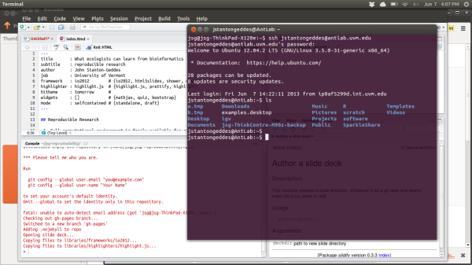
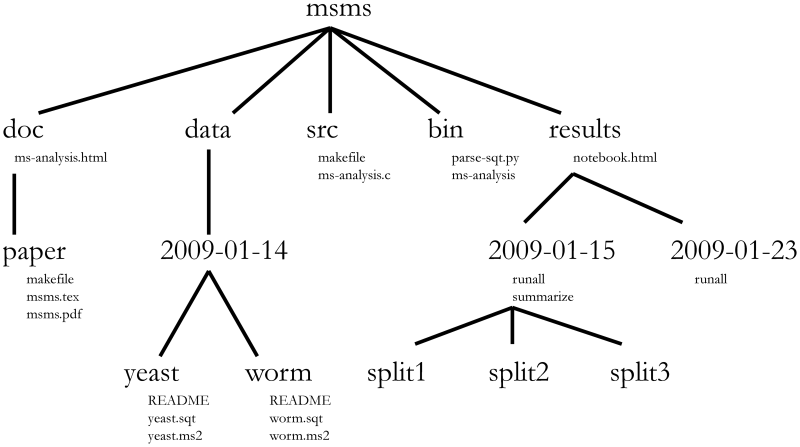
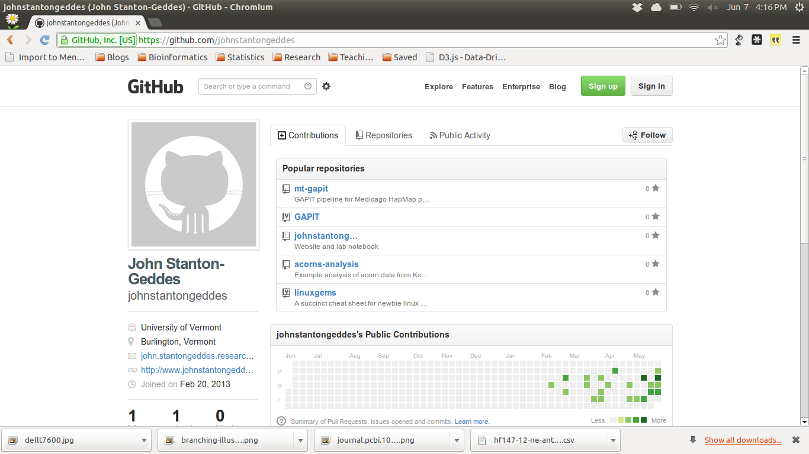
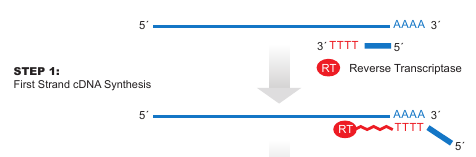
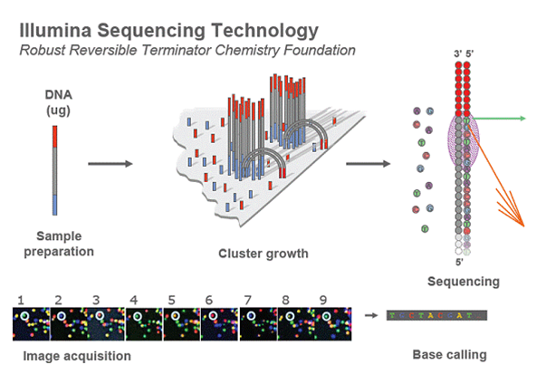
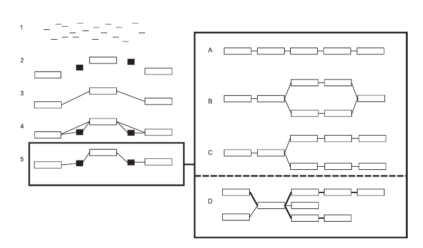
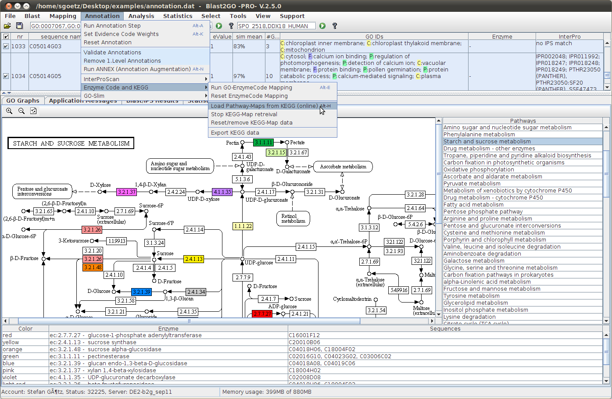

## Reproducible Research

>1. Full computational environment is freely available for reproduction
  - data
  - scripts
  - software
>2. Accountability
>3. Avoid d'oh! moments
>4. Open access ethos
>5. Journals (will) require it!

--- .class #id 

## Tools for reproducible research

>- *[R](http://www.rproject.org)* - for data analysis
>- *[Latex](http://www.latex-project.org/)* - for document preparation
>- *[knitr](http://yihui.name/knitr/)* - dynamic report generation with R
>- *[Rstudio](http://www.rstudio.org)* - putting all the pieces together
>- *[pandoc](http://johnmacfarlane.net/pandoc/)* - markdown format and file conversion
>- *[github](http://github.com)* - collaboration and accessibility

---

## antlab.uvm.edu

Remote access

---

## Organizing BIG data

---

## Version control

`git` version control

`git add` tracks a file

`git commit` saves changes

`git log` file history

`git diff` shows differences among files

`git checkout` restore to previous version

---

## Github

---

## Backup

...is essential

---

## Assembling a transcriptome

1. Collect samples
2. Extract RNA
3. Quantify
4. Library prep for sequencing
5. Illumina sequencing
6. QC raw reads
7. Assemble reads    
8. Reality check
9. Annotation
10. SNP discovery

---

## Samples

Only get mRNA transcripts for genes that are expressed!

- developmental stage
- environmental conditions
- *time of day*

---

## Library prep

Digital gene expression (DGE) tags

- 150-500 bp proximal to 3' polyA tail of mRNA transcript

16-24 samples per sequencing lane ($1000)

---

## Illumina sequencing

---

## Illumina FASTQ 

    @HWI-ST1073:326:D25DAACXX:6:1101:4672:1944 1:N:0:ATCACG
    NATGAATTTCGTCTACTTGATGTAGATAATCGTTGTGTAATACCCTTTAATTATCCCATCCGTATCTTAACAACTTCTATAGATGTAATCCATGCTTGAAC
    +
    #1=DDFFFGHGDHHJJIJIIJJIIJGIIIJIGHIIEGCIEGCHGGIIJHIJJJJGHHJIJJJFFGIJIJIJJGJHCEHEEDDFDDDF;>AEEDEDDECDCC
    @HWI-ST1073:326:D25DAACXX:6:1101:4579:1951 1:N:0:ATCACG
    NCTGTATTTATGTTGTTATCAAAAGAACAGGTTGTTAACAGTGGCGTAACTTACGTTACTAAACACGCACAGTTATTGAATAATAACAATAGAGTCGCAAA
    +
    #1BDDFFFHHHHHIIIJIJJJJJJJJJJJIJHIIGIJG?DFCFG7:?FCDIHDFCGHCFEHJEG@A5:<?<CECC>ACCACDCCD;>C@AC@>C::=>@DD
    @HWI-ST1073:326:D25DAACXX:6:1101:4561:1987 1:N:0:ATCACG
    CTGGGCTTCGTCACCCACGTAGCTGTCCTTCTGACCCATACCGACCATCACTCCCTGATGGCGAGGTCGGCCGACGATCGAGGGGAAGACGGCGCGAGGAG
    +
    CCCFFFFFHHGHHJJJIJJJGIJJJGHIJJGIIJIICHIJJJJJIIGIJCHGHIEEHGHHGFFDDD8?BDDDD9>@B<BBB?BBB-5???BB@@@B9<B##
    @HWI-ST1073:326:D25DAACXX:6:1101:4832:1916 1:N:0:ATCACG
    NCCTCTTTAAAGTACAAGGCTTTCTTTCTTCGGCTTCTCTGCATGGATCAACACGTACTTCATGTATGGTGCATTGTATAGGACGGTCCTCGGAGGCGGAT
    +
    #11AABDDAFBD?<<@FB=F?FE9@F@9CFEFG68?GGGA?<<?<FACGFGFGDB;@BCF;)@87@@DE)=C?EE7?BCEDBBC@?8;?:A?B/;@BBB<9
    
100 bp reads

---

## Assemble...

Oases-Velvet (Schulz et al 2012)

---

## Contigs

    >HWI-ST261:8:42:10665:176644#ATCACG 1  1	1
    AGTGCCAGACGTCCATCACGATGACCGTGACCCAGGCGTCGACCTCATTGGACACGTAAT
    TGTAGTTGAGGTCGAGGCGGTTCAGCACATAGC
    >HWI-ST261:8:42:10665:176644#ATCACG 2	2	1
    TCAAGGAACTGCTCGATCCATCGACCGATCTCGGCGGGCG
    >HWI-ST261:8:63:18246:112155#ATCACG 1	3	1
    CCGACGTCGACGGCGGCTACACCACCGACCCCCGCGTGGTGCCGAAGGCGCGCCGGCTC
    >HWI-ST261:8:63:18246:112155#ATCACG 2	4	1
    CTCGATCTGGCGCACGGAAATCTGGGCTTCGTCCTTG
    >HWI-ST261:8:8:13814:109994#ATCACG 1	5	1

---

## Gene prediction/annotation

BLAST2GO or GeneMark

---

## Written in R

**Reproducibile** presentations using [slidify](http://slidify.org)

Access this presentation at https://github.com/johnstantongeddes/presentations

---
